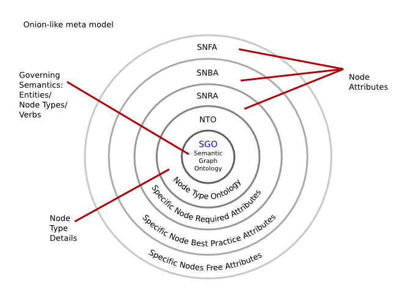

# Basic Concepts

## What is the Open Graph of IT (OGIT)?

The goal of the OGIT (Open Graph of IT) Ontology Framework is to
build an open semantic representation of all IT and its interactions with
business processes and people for providing a foundation for computational
evaluation. The resulting knowledge graph allows to interconnect various IT
entities in the IT Operations and IT Management space. While previous
approaches like the IBM Common Data Model (CDM) required too much details and
did not allow any ambiguity and incorrectness, the Open Graph of IT ontology
allows varying levels of detail and can easily consume real world data with all
its inaccuracies and redundancies.

The ontology structure is designed for growth both in depth as well as in
breadth. It encourages re-use and agreement on best practices but it also
leaves room to use data without the need to a priori agree on a common
semantics .

## OGIT’s structure
This document provides a high-level overview of the core ideas of OGIT. For more technical depth, please refer to the
[ontology details document](OGIT-ontology-details).

OGIT is an ontology that serves as a reference model for entities in the IT landscape and relationships between
entities. It is comparable to the [schema.org](https://schema.org) effort that provides schemas for structured data on
the internet. In OGIT there are three types of elements:

* _Entities_ represent concepts (nodes in the graph),
* _Verbs_ are binary relations (edges) between two Entities and describe something an Entity does to or with another,
* _Attributes_ are binary relations (edges) between an Entity and a scalar value, such as a string or an integer.

All Entities, Verbs and Attributes are uniquely identified by URIs.

The ontology is divided into 5 layers of abstraction, as shown in the following diagram:

Basically, the innermost layer contains generic concepts, such as _Device_, while the outermost layer contains
user-specific extensions. This separation exists not only for the sake of clarity of the schema, but also to determine
who is responsible for changes to certain parts of the ontology. While the innermost layer is governed rigorously,
anyone can make changes in the outermost layer. The following sections describe the layers in more detail.

### 1. SGO - Semantic Graph Ontology

[comment]: # (Ontology Board / SGO Board is neither defined nor are there any contact details provided.)

The SGO is the most generic level of OGIT and is the only layer maintained by the _Ontology Board_. Concepts that are
described in the SGO are not specific to one domain, but are broadly usable.

### 2. NTO - Node Type Ontology

An NTO contains concepts of a certain domain. The differentiation between SGO and NTO is made to allow subject matter
experts to deal with NTO definitions while strategic experts deal with the definition of the big picture.

Examples for NTOs:

* Automation
* Business Process
* Cost
* Service Management

### 3. SNRA, SNBA, SNFA - Specific Node Attributes

Each of these attribute sections describes attributes to be used with a node type that was defined in the SGO or an NTO.

#### 3.1 SNRA - Specific Node Required Attributes

Each node well-defined by SGO and NTO ontologies will have a set of attributes that is specific to this unique type of
node. The SNRA defines the minimal required attribute set. The SNRA are always included and are mandatory, so the syntax
will be checked and tools will only work properly if the SNRA definition is followed.

### 3.2 SNBA - Specific Node Best Practice Attributes

Each well-defined node type can have a number of attributes that have proven useful. If these attribute suggestions are
followed, then the reuse and effectiveness of platform resources (e.g., knowledge in automation, architectural
benchmarks) are maximized. SNBA can be understood as “optional” attributes.

### 3.3 SNFA - Specific Node Free Attributes

The Free attribute space in every node is used by applications, users and organizations to add data structured according
to their own needs, concepts and ideas. Data stored here uses the mechanisms of _OGIT_, but is not easily
reusable by other users. When similar or equivalent attributes are employed by multiple users, they may be moved up one
layer into the SNBA section to be published and discussed in a platform-wide distribution.
