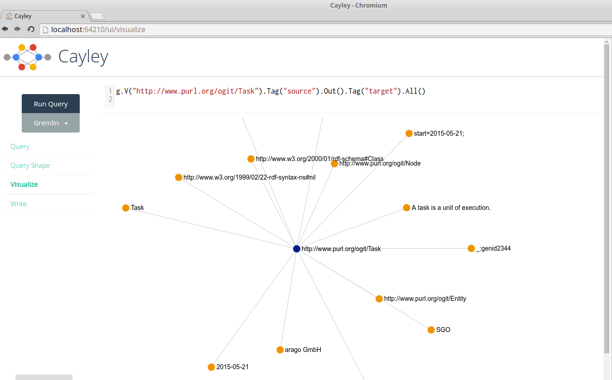

# Using OGIT in Cayley

[Cayley](https://github.com/google/cayley) is a self-contained graph database written in Go. It 
comes with a query language inspired by 
[Gremlin](http://tinkerpop.incubator.apache.org/gremlin.html) and the ability to import RDF data. As 
OGIT is described in the RDF Turtle Syntax, we can import it in Cayley and run queries on both the 
OGIT schema and data conforming to the schema.

1. We will use the [rapper](http://librdf.org/raptor/rapper.html) command-line utility to merge all
of OGIT’s turtle files into one file in N-Triples-Format. In a Debian-based system, you can install
it by running `apt-get install raptor2-utils`. Clone the OGIT repository, then in the OGIT directory
run:

	`rapper -i turtle -o ntriples <(find . -name '*.ttl' -exec cat "{}" \;) > ogit.nt`

2. Install [go](http://golang.org/) if you haven’t already. Download and build Cayley according to 
[the documentation](https://github.com/google/cayley). 

3. Start Cayley: (depending on your installation, you may have to specify the access path, e.g. for a homebrew-installation `--assets=/usr/local/opt/cayley/share/cayley/assets`)

	`cayley http --dbpath=ogit.nt`

4. Open the web interface at [http://localhost:64210/](http://localhost:64210/) .
5. Enter the following query. This will list the names of the Entities defined in OGIT.

	`g.V().Has("http://www.w3.org/2000/01/rdf-schema#subClassOf", "http://www.purl.org/ogit/Entity").Out("http://www.w3.org/2000/01/rdf-schema#label").All()`

6. You can also visualize results. Select *Visualize* in the left-hand menu, then enter the 
   following query and click on *Run Query*. This selects the `Task` entity and displays all 
   relations it has as nodes.

	`g.V("http://www.purl.org/ogit/Task").Tag("source").Out().Tag("target").All()`

