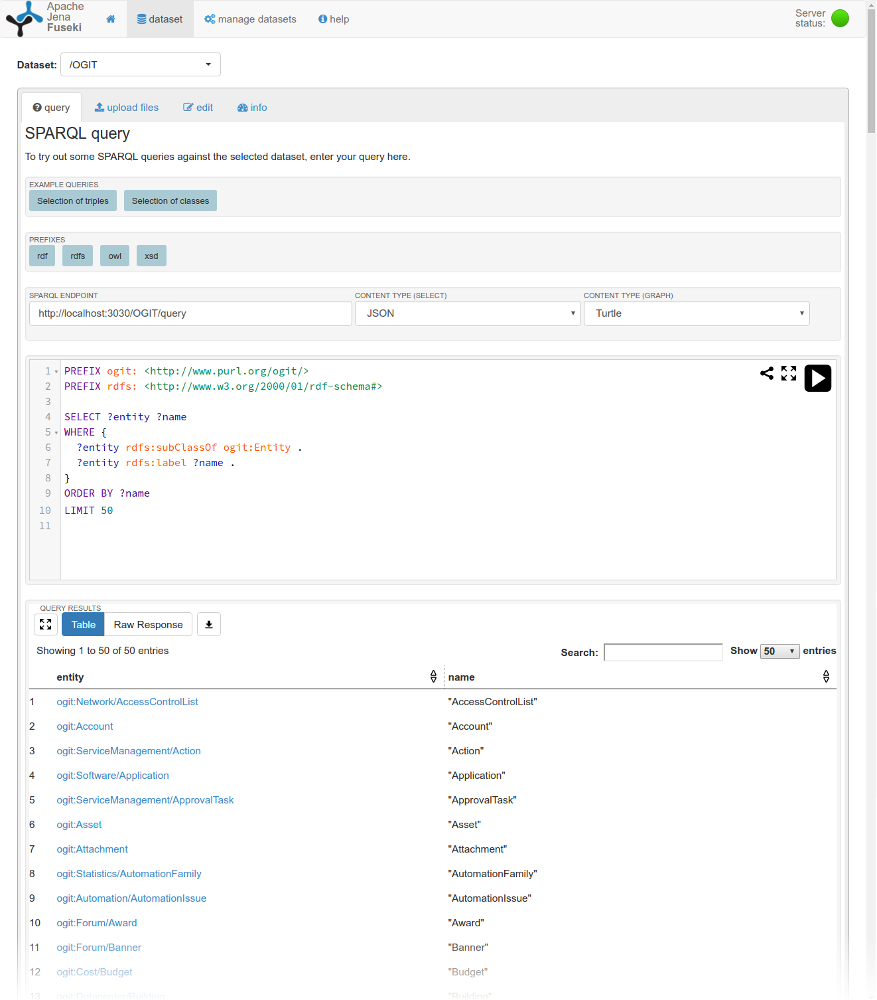

# Using OGIT in Apache Jena Fuseki

As OGIT is described in the RDF Turtle Syntax, it can be deployed in any *triple store*, i.e., a
special kind of graph database that is optimised for RDF data. This allows us to query both the OGIT
schema itself and data conforming to the schema using the
[SPARQL](https://www.w3.org/TR/sparql11-query/) query language. The following steps help you to get
started with Fuseki, the triple store based on and maintained by the [Apache
Jena](https://jena.apache.org/) project.

1. We will use the [rapper](http://librdf.org/raptor/rapper.html) command-line utility to merge all
of OGIT’s turtle files into one file in N-Triples-Format. In a Debian-based system, you can install
it by running `apt-get install raptor2-utils`. Clone the OGIT repository, then in the OGIT directory
run:

	`rapper -i turtle -o ntriples <(find -name '*.ttl' -exec cat "{}" \;) > ogit.nt`.

2. Download and extract [Fuseki](https://jena.apache.org/download/index.cgi).

3. Change to Fuseki’s directory and run `./fuseki-server --mem /OGIT`. This starts Fuseki and
creates an in-memory dataset called `OGIT`. You can also create persistent datasets, see [Fuseki’s
documentation](https://jena.apache.org/documentation/fuseki2/index.html) for that.
4. Change to the `bin/` directory. Here you will find scripts to upload and query data. To insert
the `ogit.nt` into the `OGIT` dataset, run:

	`./s-put http://localhost:3030/OGIT default /path/to/OGIT/ogit.nt`

5. Now let’s try a query on the OGIT schema. Fuseki’s web interface runs on 
[http://localhost:3030/](http://localhost:3030/) by default. Open it and select *query* for the 
`OGIT` dataset. Paste the following SPARQL query: This will list the first 50 Entities defined in 
OGIT.

	```sparql
	PREFIX ogit: <http://www.purl.org/ogit/>
	PREFIX rdfs: <http://www.w3.org/2000/01/rdf-schema#>

	SELECT ?entity ?name
	WHERE {
	  ?entity rdfs:subClassOf ogit:Entity .
	  ?entity rdfs:label ?name .
	}
	ORDER BY ?name
	LIMIT 50
	```

6. You can get the same result in JSON-Format on the command line:

	`./s-query --service=http://localhost:3030/OGIT 'paste query here'`

7. Of course you have many more options, for example, you can use the Java API or the standard
SPARQL endpoint for queries and updates.



